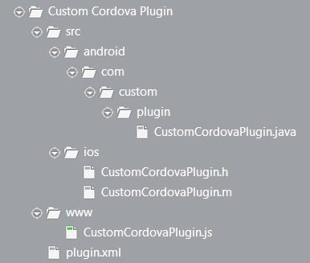

When you develop hybrid mobile applications with Apache Cordova, at some point in time, you will need to use a device capability that the core Apache Cordova APIs just does not support. That's when you'll either dig through GitHub in search of a custom plugin, or you'll resort to writing one. Whatever the case, once you have the plugin in your hands, you'll need to install it to your project. 

Whether you're using Icenium or another set of tools for cross-platform mobile development, the go-to tool for installing custom plugins is <a href="https://github.com/apache/cordova-plugman" target="_blank">Plugman</a>. The thing is, Plugman has its own requirements that your custom plugin must meet.

## What Does Plugman-Compatible Mean?

To satisfy the almighty Plugman, a custom plugin should meet the following requirements.

* The plugin should contain a valid `plugin.xml` file.
* The plugin should have a valid directory structure.

## Requirement \#1: Valid plugin.xml

The `plugin.xml` file defines the entire plugin, including its structure, changes to the configuration files, dependencies, and so on. Plugman pulls all the data from `plugin.xml` and applies the corresponding changes to the structure and the configuration files of the application package. With a proper plugin.xml file, you do not need to go and add code to `Info.plist`, `AndroidManifest.xml`, or `config.xml` manually. Also, if you declare the plugin JavaScript file in a <code>&lt;js-module&gt;</code> element, you do not need to reference the plugin script file in the `index.html` file for your app.

You can find the complete `plugin.xml` specification **<a href="http://cordova.apache.org/docs/en/3.0.0/plugin_ref_spec.md.html#Plugin%20Specification" target="_blank">here</a>**. In a glimpse, it breaks down to the following steps.

1. Define the document as an XML document.
1. Declare the top-level `<plugin>` element with a plugin namespace, version, and identifier.
1. Declare the files that contain the plugin functionality in an `<asset>` or a `<js-module>` element. With the <code>&lt;asset&gt;</code>, you declare one or more files of any type or folders that need to be copied to the application file structure. These files and folders contain the plugin functionality and you need to explicitly reference them from the application code. With the <code>&lt;js-module&gt;</code> element, you declare one or more JavaScript files in the CommonJS module format. These files contain the plugin functionality and you do not need to reference them from the application code. You do not need to make any references because Apache Cordova handles any <script> includes for you.
1. Declare the platform-specific information for each supported mobile platform in a separate `<platform>` element.
	1. Declare any transformations that need to be made to the configuration files in a `<config-file>` element. Set the path and the parent XML element for the changes.
		1. Add the plugin to `config.xml` to map it to the native APIs. For Apache Cordova 2.x projects, use the `<plugin>` element. For Apache Cordova 3.x projects, use the `<feature>` element.
		1. Add any permissions, activities, intents, and other configuration settings that the plugin requires for Android to `AndroidManifest.xml`. Use the same markup you would use when editing `AndroidManifest.xml` manually.
		1. Add any configuration settings that the plugin requires for iOS to `Info.plist`. Use the same markup you would use when editing `Info.plist` manually.
	1. Declare the source, resource, and header files that contain the native functionality for the corresponding platform in `<source-file>`, `<resource-file>`, or `<header-file>` elements.

A more thorough overview of the process, including sample code, is available **<a href="http://docs.icenium.com/creating-your-project/using-plugins/using-custom-plugins/making-plugman-compatible/create-modify-plugin-xml" target="_blank">here</a>**.

You can also use the following templates as a starting point. Just replace the placeholders with the correct values for your plugin and comment out or delete any unnecessary elements. Most of the time, the changes you will need to make to these templates will be trivial.

<table border="1">
	<tr>
		<th>&nbsp;</th>
		<th>Targeting iOS and Android</th>
		<th>Targeting Android</th>
		<th>Targeting iOS</th>
	</tr>
	<tr>
		<th>Targeting Apache Cordova 2.x</th>
		<td>A <b><a href="01-plugin.xml" target="_blank">plugin.xml</a></b> template using the <code>&lt;asset&gt;</code> element. A <b><a href="02-plugin.xml" target="_blank">plugin.xml</a></b> template using the <code>&lt;js-module&gt;</code> element.</td>
		<td>A <b><a href="05-plugin.xml" target="_blank">plugin.xml</a></b> template using the <code>&lt;asset&gt;</code> element. A <b><a href="06-plugin.xml" target="_blank">plugin.xml</a></b> template using the <code>&lt;js-module&gt;</code> element.</td>
		<td>A <b><a href="09-plugin.xml" target="_blank">plugin.xml</a></b> template using the <code>&lt;asset&gt;</code> element. A <b><a href="10-plugin.xml" target="_blank">plugin.xml</a></b> template using the <code>&lt;js-module&gt;</code> element.</td>
	</tr>
	<tr>
		<th>Targeting Apache Cordova 3.x</th>
		<td>A <b><a href="03-plugin.xml" target="_blank">plugin.xml</a></b> template using the <code>&lt;asset&gt;</code> element. A <b><a href="04-plugin.xml" target="_blank">plugin.xml</a></b> template using the <code>&lt;js-module&gt;</code> element.</td>
		<td>A <b><a href="07-plugin.xml" target="_blank">plugin.xml</a></b> template using the <code>&lt;asset&gt;</code> element. A <b><a href="08-plugin.xml" target="_blank">plugin.xml</a></b> template using the <code>&lt;js-module&gt;</code> element.</td>
		<td>A <b><a href="11-plugin.xml" target="_blank">plugin.xml</a></b> template using the <code>&lt;asset&gt;</code> element. A <b><a href="12-plugin.xml" target="_blank">plugin.xml</a></b> template using the <code>&lt;js-module&gt;</code> element.</td>
	</tr>
</table>

Sometimes, `plugin.xml` might require additional work though. For example, this is the case with the BarcodeScanner plugin which contains multiple source files and depends on some native iOS frameworks. Here's how you can check out the implementation of the BarcodeScanner plugin and its valid `plugin.xml` file in Icenium.

<embed src="making-plugman-compatible.swf" width="800" height="500">

Or, you can <a href="http://docs.icenium.com/creating-your-project/using-plugins/using-integrated-plugins/add-plugins" target="_blank">enable any of the integrated plugins</a> in an Icenium project and check out their corresponding `plugin.xml` files for reference.

<embed src="making-plugman-compatible-1.swf" width="800" height="500">

## Requirement \#2: Valid Directory Structure

This one is more of a recommendation and less of a requirement. The rules are pretty simple. 

* `plugin.xml` goes in the root of the plugin.
* The script file for the plugin goes in a `www` folder in the root of the plugin.
* Any platform-specific files go in an `src` foler in the root. Android files go in `src\android` and iOS files - in `src\ios`. Some additional rules apply to the platform-specific folders. (For example, you might need to put the Android files in a folder structure that represents the `package` declaration in the `JAVA` file for the plugin.)

You can find the complete guide for the changes you need to make to the directory structure along with some examples **<a href="http://docs.icenium.com/creating-your-project/using-plugins/using-custom-plugins/making-plugman-compatible/modify-directory-structure" target="_blank">here</a>**. After you make all the necessary changes, your folder structure should look like this.

## Last but Not Least

When using a custom plugin, Plugman-compatible or not, make sure that the plugin is compatible with the target Apache Cordova version of your project. 

If after you cover the requirements of Plugman, you are still unable to install the custom plugin, you might want to poke around the plugin code and update it. You can check out some of these resources as a starting point.

* <a href="http://devgirl.org/2013/09/17/how-to-write-a-phonegap-3-0-plugin-for-android/" target="_blank">How to Write a PhoneGap 3.0 Plugin for Android</a>
* <a href="http://simonmacdonald.blogspot.ca/2013/06/why-dont-my-plugins-work-in-phonegap.html" target="_blank">Why Don't My Plugins Work in PhoneGap Android 2.7?</a>
* <a href="https://github.com/phonegap/phonegap/blob/master/lib/ios/guides/Cordova%20Plugin%20Upgrade%20Guide.md" target="_blank">Cordova Plugin Upgrade Guide</a>